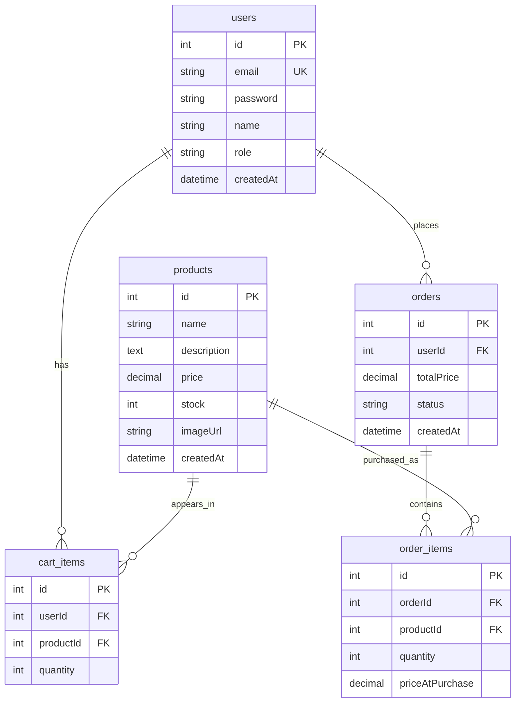

# E-Commerce ERD

This document is the database plan for the project.

The project follows the handoff requirements:
- PostgreSQL relational database
- TypeORM as the ORM
- Users, products, cart, and orders
- Admin role support
- Product images stored as URLs, not inside PostgreSQL or the server

## Tables

### users

Stores registered users and admins.

| Column | Type | Notes |
| --- | --- | --- |
| id | serial primary key | Internal user id |
| email | varchar unique | Used for login |
| password | varchar | Hashed password, never plain text |
| name | varchar | Display name |
| role | enum | `user` or `admin` |
| createdAt | timestamp | Created automatically |

### products

Stores products that appear in the shop.

| Column | Type | Notes |
| --- | --- | --- |
| id | serial primary key | Internal product id |
| name | varchar | Product name |
| description | text | Product description |
| price | decimal(10,2) | Product price |
| stock | integer | Available quantity |
| imageUrl | varchar | URL from Cloudinary/S3/etc. |
| createdAt | timestamp | Created automatically |

### cart_items

Stores the current cart for each user.

| Column | Type | Notes |
| --- | --- | --- |
| id | serial primary key | Internal cart item id |
| userId | foreign key | References `users.id` |
| productId | foreign key | References `products.id` |
| quantity | integer | Quantity in cart |

Rules:
- One user should not have duplicate rows for the same product.
- If a user is deleted, their cart items are deleted.
- If a product is deleted, related cart items are deleted.

### orders

Stores completed orders.

| Column | Type | Notes |
| --- | --- | --- |
| id | serial primary key | Internal order id |
| userId | foreign key | References `users.id` |
| totalPrice | decimal(10,2) | Total order price |
| status | enum | `pending`, `shipped`, `delivered`, `cancelled` |
| createdAt | timestamp | Created automatically |

### order_items

Stores the products inside each order.

| Column | Type | Notes |
| --- | --- | --- |
| id | serial primary key | Internal order item id |
| orderId | foreign key | References `orders.id` |
| productId | foreign key | References `products.id` |
| quantity | integer | Quantity purchased |
| priceAtPurchase | decimal(10,2) | Product price when the order was created |

Why `priceAtPurchase` exists:
If a product price changes later, old orders should still show the original price.

## Relationships

## Next Database Steps

1. Install PostgreSQL or make sure `psql` is available.
2. Create a database named `shop_exe`.
3. Create `server/.env` from `server/.env.example`.
4. Start the NestJS server.
5. TypeORM will create the tables during development because `synchronize: true` is enabled.

Important:
`synchronize: true` is useful for development only. In a production project, migrations are safer.

